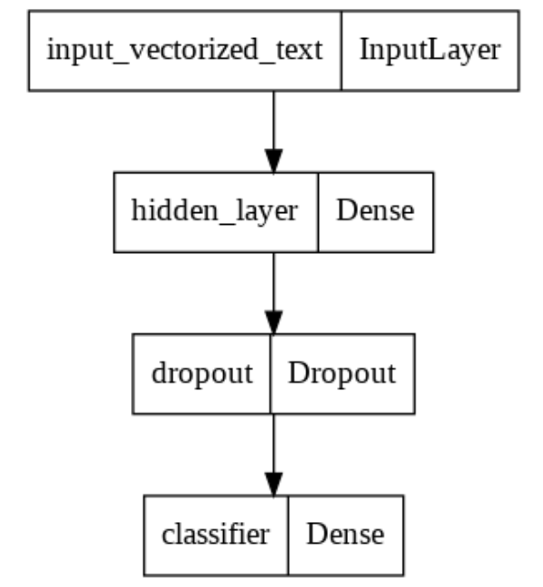
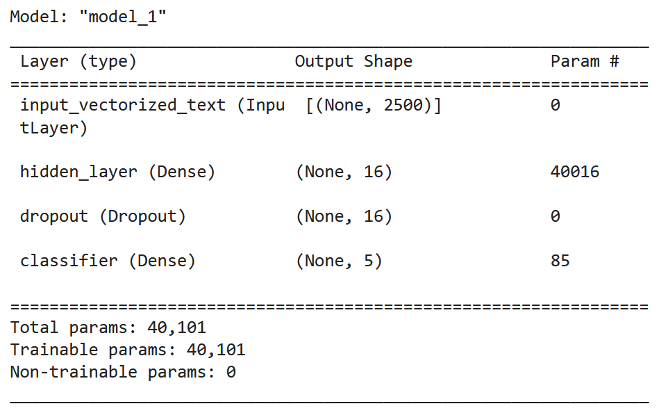
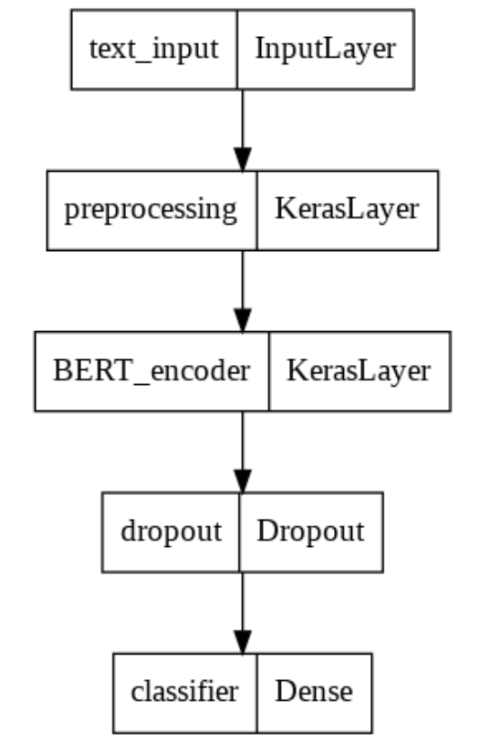
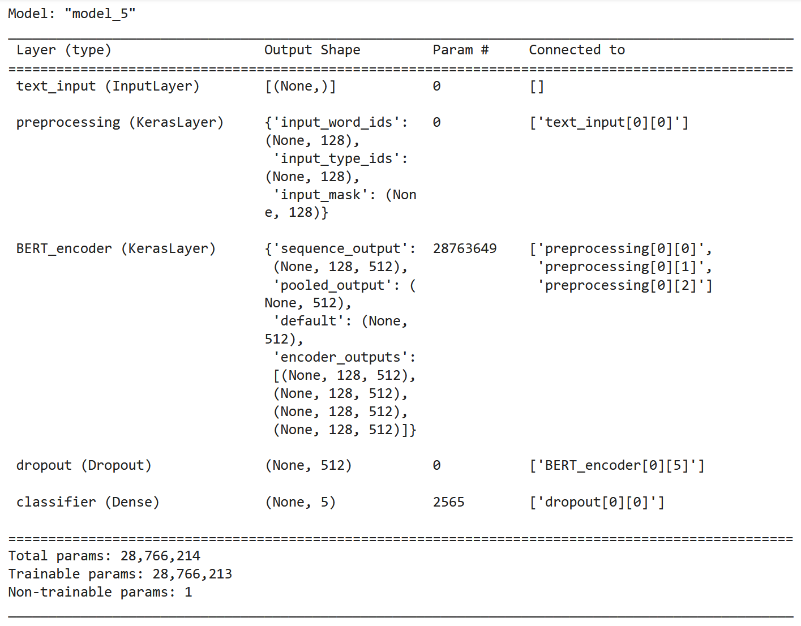

# Yelp Restuarant Review Challenge

## Abstract
This report considers the rating prediction problem from review texts based on the Yelp challenge dataset. Beginning with a simple baseline model, we explore various classification approaches. For the random forest model, we extract features via sentiment lexicon; while for the gradient boosting classifier, such work is done by TF-IDF. In addition, we explore some higher-end deep learning models: we not only build a simple neural network classifier after preprocessing the review text with bag-of-bigrams and TF-IDF, but also apply a pretrained BERT classifier. Each of the above-mentioned models is fit on the training subset and evaluated on the testing subset with three metrics: accuracy, $F$ score, and $R^2$ score.

## Table of Contents
- [Introduction](#introduction)
  - [Dataset and Problem Formulation](#dataset-and-problem-formulation)
  - [Metrics](#metrics)
    - [Accuracy](#accuracy)
    - [*F* Score](#f-score)
    - [*R*2 Score](#r2-score)
  - [Data Preprocessing](#data-preprocessing)
- [Feature Engineering and Modeling](#feature-engineering-and-modeling)
  - [Baseline Model](#baseline-model)
  - [Sentiment Lexicon + Random Forest Classifier](#sentiment-lexicon--random-forest-classifier)
  - [TF-IDF + Gradient Boosting Classifier](#tf-idf--gradient-boosting-classifier)
  - [Bag-of-Bigrams + Neural Network Classifier](#bag-of-bigrams--neural-network-classifier)
  - [BERT Classifier](#bert-classifier)
- [Conclusion](#conclusion)
  - [Results](#results)
  - [Post-Hoc Analysis](#post-hoc-analysis)
    - [Accuracy per Class](#accuracy-per-class)
    - [Extreme Misclassification](#extreme-misclassification)
  - [Further Approaches](#further-approaches)
- [Work Cited](#work-cited)

## Introduction

### Dataset and Problem Formulation

Yelp has been one of the most popular Internet ratings and reviews sites for local businesses since its initial inception in 2004. It is an online review site in which customers share their experiences and help others make informed decisions about restaurants, auto-repair shops, and more. Those reviews allow consumers to trust a small business and be confident in their purchasing decisions, and from a business perspective, the higher the review ratings on Yelp, the better chance it will attract more consumers.

The provided dataset is on customers’ reviews of restaurants in California. Aside from a text review, the dataset also includes the user’s and the business’s unique identification number (string), the user’s rating (integer, 1-5), text comments (string), a summary of other users’ reactions toward the comments (integer per category), geographical information of the business, and some other users’ profile. A total of 53,845 records are sampled in this dataset.

We are interested in predicting rating from the text review, as it is one of the most popular, albeit hard, machine learning problems in time . The rating is a categorical variable, with 5 classes, 1 to 5. Thus, we proceed with a classification approach.

### Metrics

To compare the performance of various models, metrics have to be defined in the first place.

#### Accuracy

One natural metric for classification problems is accuracy, which is defined as
$$\text { accuracy }=\frac{\text { number of correct predictions }}{\text { number of total predictions }}.$$
The accuracy measure reaches its best value at 1 and its worst score at 0.

#### *F* Score

However, as the dataset is highly unbalanced, as shown in Fig. <a href="#pie" data-reference-type="ref" data-reference="pie">[pie]</a>, using the macro-F score (also called *F* score) would be a more appropriate choice. Macro-F is an arithmetic mean of per-class F scores, which are the harmonic means of precision and recall per class. For the i-th class, *F* score is defined as:
$$F_i=2 \cdot \frac{\text {precision}\_i \cdot \text {recall}\_i}{\text {precision}\_i+\text {recall}\_i},$$
where
$$\text{precision}\_i = \frac{\text{TP}\_i}{\text{TP}\_i + \text{FP}\_i},$$
and
$$\text{recall}\_i = \frac{\text{TP}\_i}{\text{TP}\_i + \text{FN}\_i}.$$
Macro-F score (denoted by *F*) is then defined as
$$F:=\operatorname{macro} F:=\frac{1}{k} \cdot \sum\_{i=1}^k F_i,$$
where *k* is the number of classes, which, in our case, is 5.

The *F* measure reaches its best value at 1 and its worst score at 0.

#### *R*2 Score

Lastly, as the rating is ordinal - a 5-star is better than a 4-star, we want a metric that would penalize misclassifying 5 to 1 more than misclassifying to 5 to 4 more. Therefore, we add a third metric: *R*2 (coefficient of determination) score , which is defined by
$$R^2(y, \hat{y})=1-\frac{\sum\_{i=1}^n\left(y_i-\hat{y}\_i\right)^2}{\sum\_{i=1}^n\left(y_i-\bar{y}\right)^2},$$
where $\bar{y}=\frac{1}{n} \sum\_{i=1}^n y_i$ and *ŷ**i* the predicted value of i-th instance.

The best possible *R*2 score is 1.0; lower values are worse, and it can go to negative infinity as the model can be arbitrarily worse.

### Data Preprocessing

Before modeling starts, a series of cleaning is necessary to ensure the quality of textual data:

1.  In English grammar, punctuation is essential for readability; however, it does not add any additional meaning to the text. Therefore, we remove all punctuation with regular expression filtering.

2.  In the English language, a lot of words are considered "stop words", such as "the", "a", and "is", et cetera. They serve only for the lexical completeness of sentences, without adding meaning to the sentence. Thus, we remove them with the NLTK package so the models only consider words pertaining to the specific context of the sentences. However, the word "not" is included in the stopwords list of NLTK, and we need to remove it first as it negates the meaning of the sentence, which is critical to sentiment analysis.

3.  Additionally, a few techniques are applied to cluster duplicates: we transliterate all Unicode text to ASCII, change all the letters into lowercase, and remove the stemming of verbs. These measures further reduce the number of unique words the models consider.

4.  Lastly, we delete all numbers and excessive spaces to keep the data clean.

We finally split the cleaned dataset into a training set for model-fitting and a testing set for model-evaluating on a 7:3 ratio.

## Feature Engineering and Modeling

### Baseline Model

As a baseline, we use the most dominant rating of the training set, which is 5 in our case, for predicting every single rating in the testing set, regardless of what the actual review is.

The baseline model is a simple model which the performance of other more complicated models can compare to and improve upon. If the more complicated models are unable to outperform the baseline model, it is a sign of their lack of predictive power.

The baseline model yields an accuracy of 0.396, *F* score of 0.114, and *R*2 of -0.878.

### Sentiment Lexicon + Random Forest Classifier

A sentiment lexicon is a collection of words (also known as polar or opinion words) associated with their sentiment orientation, that is, positive or negative . We can apply a count vectorizer to our text data by counting how many times each of the words in sentiment lexicon appear in each sentence and create a *N* × *M* matrix, where *N*=number of sentences and *M*=number of unique vocabularies in the sentiment lexicon.

The random forest model consists of a large number of individual decision trees, where it altogether operates as an ensemble. Based on each prediction produced by the decision trees, the value with the most occurrences becomes the entire model’s prediction. In other sense, the random forest model operates as a set of individualized – not necessarily correlated – tasks that come together in the end.

To train the model, we apply the random forest classifier on the matrix produced by applying sentiment lexicon. This model yields an accuracy of 0.498, an *F* score of 0.351, and an *R*2 of 0.074.

### TF-IDF + Gradient Boosting Classifier

TF-IDF can be a very handy metric for determining how important a term is in a document. It is the product of two statistics, term frequency, and inverse document frequency. Here, term frequency, *t**f*(*t*,*d*) is the relative frequency of term *t* within document *d*,
$${\displaystyle \mathrm {tf} (t,d)={\frac {f\_{t,d}}{\sum \_{t'\in d}{f\_{t',d}}}}}\text{,}$$
where *f**t*, *d* is the raw count of a term in a document. The more often appear in a sentence, and the less it appears in other sentences, the more important it is to the meaning of the sentence, and therefore has a higher TF-IDF score. We can use TF-IDF to convert text data to meaningful matrices before applying our classification model.

Gradient Boosting is in the form of an ensemble of weaker prediction models, which are typically decision trees. However, instead of fitting a predictor on the data at each iteration, it actually fits a new predictor to the residual errors made by the previous predictor.

At each stage, gradient boosting introduces a new tree to the ensemble, trained to correct the errors made by the current ensemble of trees. The trees are trained in sequence, with each tree attempting to correct the mistakes of the previous tree. At each stage, gradient boosting uses the gradient of the loss function to fit the new tree, so that the loss function is minimized. This process continues until the ensemble is strong enough to make accurate predictions on new data, or until a pre-determined number of trees has been trained. And in the context of classification, each tree in the ensemble is trained to predict the probability of a given example belonging to a certain class.

This model yields an accuracy of 0.537, an *F* score of 0.402, and an *R*2 of 0.117.

### Bag-of-Bigrams + Neural Network Classifier

In a bag-of-bigram model, instead of only looking at the relative frequency of single words as in TF-IDF, we also look at groups of 2 consecutive words. Words express more meaning when placed in phrases: for instance, if we solely look at the words "come" and "again" separately, neither of them independently implies a user’s positive feeling toward the business. Yet, if we concatenate them together, "come again" implies such a preference. Using the bag-of-bigram processor creates a set model, meaning we discard the order of the words and treat text as an unordered set of words. This makes sense because when we try to predict the customer’s rating on restaurants, we look for keywords such as "great restaurants" or "terrible", disregarding their relative order.

Again, we vectorize the text by TF-IDF, but feed it into a neural network: we apply a relatively simple neural network: a layer with 16 nodes with the Relu activation function, a dropout layer, and a final layer with the sigmoid activation function.

The neural network structure and hyperparameters are illustrated in Fig. <a href="#bigram" data-reference-type="ref" data-reference="bigram">[bigram]</a>.

 

We use "Sparse Categorical Cross-entropy" as the loss function.

We achieve the following performance: accuracy of 0.546, *F* score of 0.434, and *R*2 value of 0.387.

### BERT Classifier

BERT is short for Bidirectional Encoder Representations from Transformers. The idea of Transformers comes from the famous paper "Attention Is All you Need" , where the authors propose a revolutionary transformer system that solely relies on attention mechanisms to learn global dependencies between input and output and overcomes the parallelization problem often seen in Recurrent Neural Network models. Google’s BERT model is based on such an attention mechanism. It provides two advantages over traditional machine learning algorithms and local deep learning models: firstly, it is a pretrained unsupervised model trained on around 800 million English words; it is a size so large that the model is pretrained so well that it can be applied on small datasets and achieve have good performance. Secondly, BERT is able to account for a word’s context. Previous methods of word vectorization would return the same vector for a word no matter how it is used, while BERT returns different vectors for the same word depending on the word’s context. A model that is able to distinguish between different use-cases for a word would retrieve more information from limited words, and the performance will thus increase.

For our project, we use Google’s BERT Small Uncased model as a feature extractor model; we add a Dropout layer of 0.1 to prevent overfitting and a Dense layer of 5 with the sigmoid activation function for the classification purpose. The model structure and hyperparameters are illustrated in Fig. <a href="#fig:bert" data-reference-type="ref" data-reference="fig:bert">[fig:bert]</a>. We again use "Sparse Categorical Cross-entropy" as the loss function.

 

Our model achieves an accuracy of 0.593, an *F* score of 0.545, and an *R*2 score of 0.499 on the testing set, very high given the randomness in the nature of textual data.

## Conclusion

### Results

We compare the performance of the 5 models on the testing set in Table <a href="#table:1" data-reference-type="ref" data-reference="table:1">1</a>.

|                  **Model**                   | **Accuracy** | ***F* score** | ***R*2** |
|:--------------------------------------------:|:------------:|:-------------:|:-------------------:|
|                Baseline Model                |    0.396     |     0.114     |       -0.878        |
| Sentiment Lexicon + Random Forest Classifier |    0.498     |     0.351     |        0.074        |
|    TF-IDF + Gradient Boosting Classifier     |    0.537     |     0.402     |        0.117        |
|  Bag-of-Bigrams + Neural Network Classifier  |    0.546     |     0.434     |        0.387        |
|               BERT Classifier                |    0.593     |     0.545     |        0.499        |

A comparison of the performance of 5 different models on the testing set.

### Post-Hoc Analysis

#### Accuracy per Class

In this section, we study how our best model performs in each class.

| **Rating** | **Number of total predictions** | **Number of correct predictions** | **Accuracy** |
|:----------:|:-------------------------------:|:---------------------------------:|:------------:|
|     1      |               569               |                296                |    0.520     |
|     2      |              1074               |                438                |    0.408     |
|     3      |              2516               |               1230                |    0.489     |
|     4      |              5595               |               3258                |    0.582     |
|     5      |              6400               |               4332                |    0.677     |

The accuracy per class of BERT Classifier on the testing set.

As shown in Table <a href="#table:2" data-reference-type="ref" data-reference="table:2">2</a>, the model reaches the highest accuracy on rating 5 and second highest on rating 4, which is the most dominant class and the second most dominant class. This shows that in order to build a classifier that demonstrates equity among classes, a balanced dataset with more data is needed.

#### Extreme Misclassification

In this section, we explore some possible reasons for extreme misclassification.

We define a misclassification to be an extreme misclassification if:

-   The ground truth is rating 1 but our classifier yields a prediction of 5; or

-   The ground truth is rating 5 but our classifier yields a prediction of 1.

Here, we randomly pick two of the 27 extreme misclassifications and manually study the reason behind them.

This first review has a corresponding rating of 5, yet our model predicts it as 1, while the second review has the opposite. We conclude that although the BERT model is a contextual model, it is unable to understand certain human sarcasm. More training data containing similar sarcasm is needed in order for our model to learn it. However, given that we only have 37,691 instances for training, very scarce for an NLP task, the model yields satisfying performance for most cases.

### Further Approaches

There’s another interpretation hence an alternative approach to this problem. Since the target variable values are integers ranging from 1 to 5, we may also attempt regression models for prediction. We may use the TF-IDF matrix of each text review as a predictor in, for example, a linear regression model, and take its nearest neighboring integer in the range [1, 5] as the predicted value. In that case, we also need to address the issue of overfitting in some of the models.

## Work Cited
> N. Asghar, *Yelp dataset challenge: Review rating prediction*, 2016. DOI: 10.48550/ARXIV.1605.05362. Available: https://arxiv.org/abs/1605.05362.

> F. Pedregosa et al., "Scikit-learn: Machine learning in Python," *Journal of Machine Learning Research*, vol. 12, pp. 2825-2830, 2011. 

> S. Bird, E. Loper, and E. Klein, *Natural Language Processing with Python*. O'Reilly Media Inc., 2009. 

> M. Hu and B. Liu, "Mining and summarizing customer reviews," in *Proceedings of the tenth ACM SIGKDD international conference on Knowledge discovery and data mining*, 2004, pp. 168-177. 

>B. Liu, M. Hu, and J. Cheng, "Opinion observer: Analyzing and comparing opinions on the web," in *Proceedings of the 14th international conference on World Wide Web*, 2005, pp. 342-351. 

> A. Vaswani et al., "Attention is all you need," *Advances in neural information processing systems*, vol. 30, 2017. 

> I. Turc, M.-W. Chang, K. Lee, and K. Toutanova, "Well-read students learn better: On the importance of pre-training compact models," *arXiv preprint arXiv:1908.08962*, 2019. 
